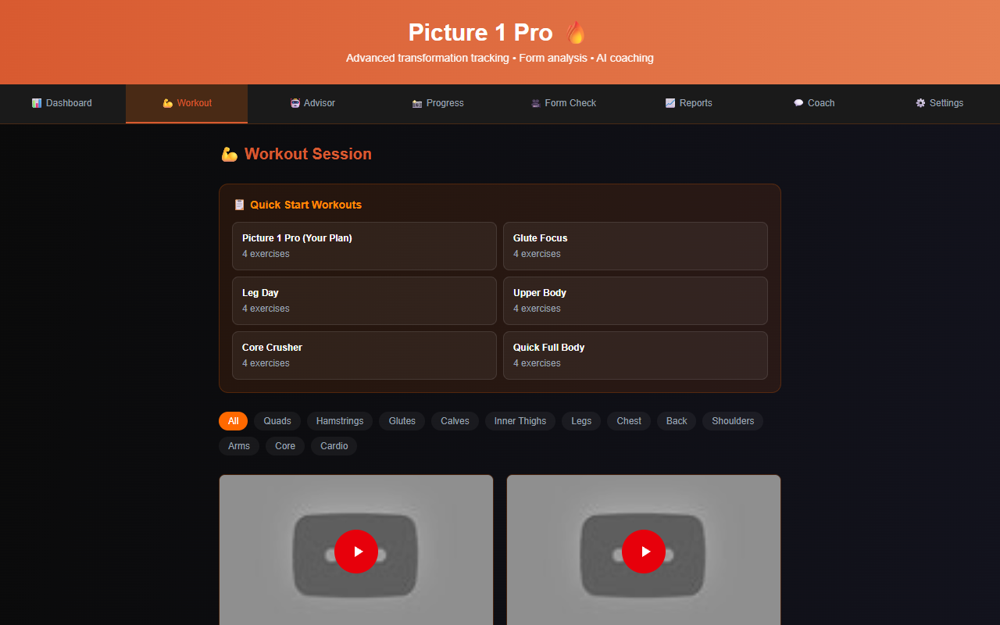
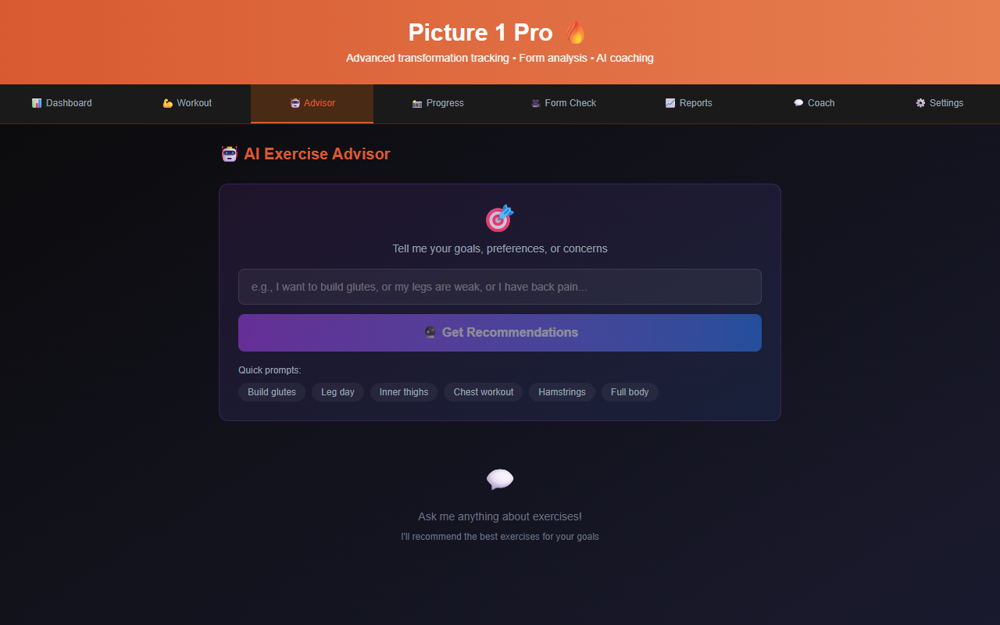

# Picture 1 Pro - Fitness Transformation App

A comprehensive fitness tracking web app with workout videos, AI coach, progress photos, and personalized workout plans.

## Features

- **Dashboard** - Track weight, measurements, water intake, and achievements
- **Workout Library** - 50+ exercises with video tutorials
- **Preset Plans** - Picture 1 Pro, Push/Pull/Legs, Full Body, HIIT
- **AI Coach** - Contextual fitness guidance
- **Voice Announcements** - Hands-free workout guidance
- **Progress Photos** - Track visual transformations
- **Reminders** - Workout, water, meals, and check-ins
- **Multiple Themes** - Dark, Light, Ocean, Sunset, Forest, Purple

## Screenshots

### Dashboard


### Workout Session


### Exercise Details


### AI Coach


### Settings & Themes


## Tech Stack

- **Framework:** Next.js 16
- **Language:** TypeScript
- **Styling:** Tailwind CSS
- **Deployment:** Vercel

## Getting Started

```bash
git clone https://github.com/punamkroy6-art/fitness-app.git
cd fitness-app
npm install
npm run dev
```

## Live Demo

🚀 https://fitness-app-ten-azure.vercel.app

---

Built with ❤️ for fitness transformations
